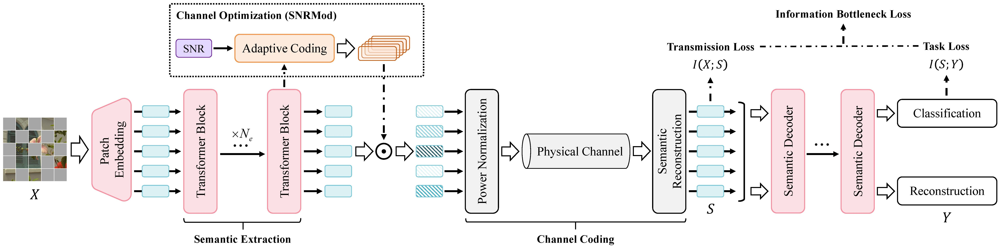

# G2SC

The officialPytorch implementation for the paper "GAI-Driven Knowledge Distillation for Personalized Semantic Communications via Federated Learning".

## Introduction

Semantic communication (SC) combines advanced artificial intelligence (AI) with traditional wireless communication to accommodate various task-oriented scenarios. However, with the growing requirements for personalization, users expect customized and specialized communication services. Federated learning (FL) attracts attention as a technology that simultaneously ensures personalized services and privacy protection, yet it remains incompatible with the SC architecture. Specifically, SC requires additional consideration of the impact of the physical channel, which means that changes in channel assumptions would necessitate retraining the model. However, under FL conditions, such a cost is unacceptable. A key insight is that channel coding can be shared across all SC models, whereas user knowledge is unique. Therefore, we decouple personalized demand from general functions within SC and propose a two-stage SC framework, named distillation-to-SC (D2SC). In the first stage, we employ FL to extract knowledge from private user data by knowledge distillation. To elaborate, we employ pretrained generative AI as the teacher, which has strong semantic modeling capability, to transfer the knowledge to the student. In the second stage, since the student model contains specialized knowledge for each user, we can reuse it by incorporating the physical channel and semantic decoding. Moreover, we design a dual transmission optimization to address the adverse effects of channel fading on semantic transmission. Extensive experiments demonstrate that D2SC achieves optimal performance across multiple SC tasks and effectively handles both unknown channel interference in transmission and imbalanced data distributions.

## Code

`main_distill.py` and `main_finetune.py` represent the first stage and the second stage of D2SC, respectively. Hyperparameters are configured through the command line. During execution of the first stage, a teacher model is required, and we adopt the official implementation of [MAE](https://github.com/facebookresearch/mae).  The path to the teacher model is specified using `--teacher_path`.

Before running, the `--data_path` parameter is adjusted according to the specific environment. The `--output_dir` argument specifies the directory for logging during execution. Logs are recorded in TensorBoard format.

`channel.py` implements the physical channel and supports Rayleigh and AWGN channels. The implementation refers to [SwinJSCC](https://github.com/semcomm/SwinJSCC).

For your convenience, we provide quick start scripts, `FL_distill.sh` and `SC_task.sh` as running examples.

As stated in the paper, when training from scratch, `FL_distill.sh` is executed first to save the pretrained weights. Subsequently, the pretrained weights are loaded in `SC_task.sh` to complete the second stage of training.

To facilitate visualization of the non-IID setting, we add a data distribution visualization interface, `distribution_visualization`, in `dataset_distill.py`. The `computional_demand.py` file enables convenient calculation of model parameters and computational requirements of D2SC for quantitative analysis.

## Weight

The completely trained model weights and execution logs are released as open source after the paper is accepted.

## Reference Work

M-JSCC: https://ieeexplore.ieee.org/abstract/document/10807235

FedSFD: https://ieeexplore.ieee.org/document/10599557

PSFL: https://ieeexplore.ieee.org/document/11073781

DMAE: https://arxiv.org/abs/2208.12256
